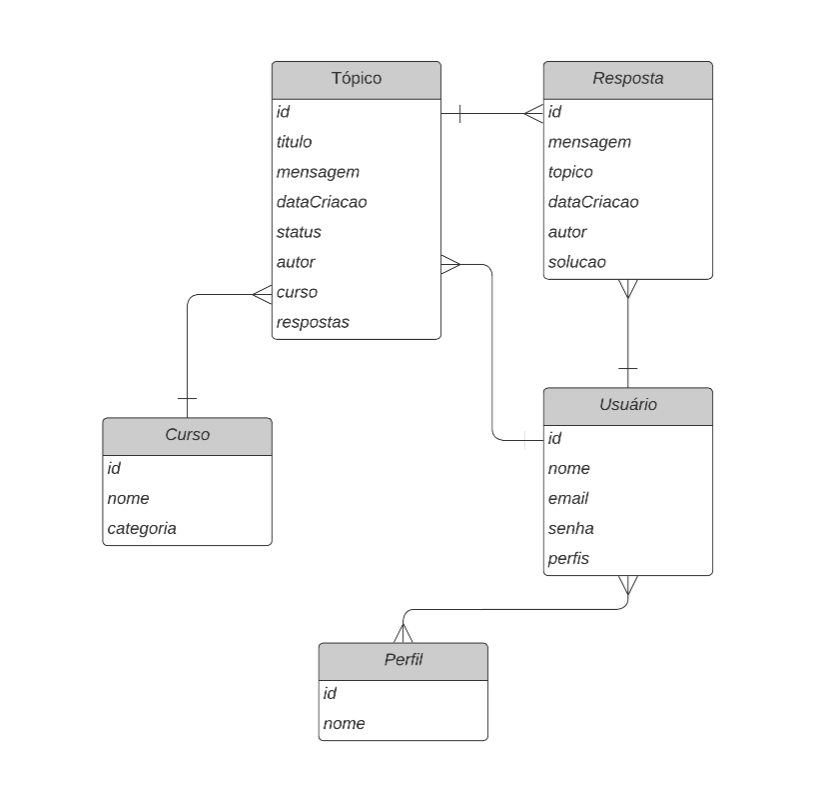

<h1 align="center"> Challenge Forum Hub </h1>

Challenge ONE Back End - Java.

Sprint 03: Challenge Forum Hub.

 

  

## 🚀 Tecnologias

Esse projeto foi desenvolvido com as seguintes tecnologias:

- Java
- Spring Boot
- MySql
- Maven

## 💻 Projeto

## 4. ✅ Implementações
- [x] Aplicação final
  - [x] API com rotas implementadas seguindo as melhores práticas do modelo REST;
  - [x] Validações realizadas segundo as regras de negócio;
  - [x] Implementação de uma base de dados relacional para a persistência da informação;
  - [x]  Serviço de autenticação/autorização para restringir o acesso à informação;

Um fórum é um espaço onde todos os participantes de uma plataforma podem colocar suas perguntas sobre determinados assuntos. Aqui na Alura, os alunos e alunas utilizam o fórum para tirar suas dúvidas sobre os cursos e projetos em que estão participando. Este lugar mágico está cheio de muita aprendizagem e colaboração entre alunos, professores e moderadores. FórumHub: nele, vamos replicar este processo no nível do back end e, para isso, criaremos uma API REST usando Spring.